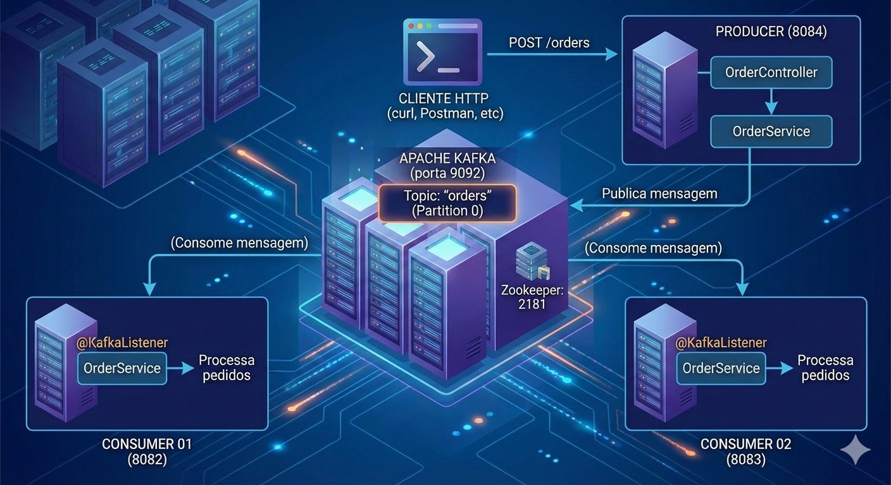

# Prática de Mensageria com Kafka

Projeto demonstrativo de arquitetura de mensageria assíncrona utilizando **Apache Kafka** com **Spring Boot**.

## 🎯 Visão Geral

- **Producer**: expõe uma API REST para receber pedidos e publica mensagens no Kafka.
- **Consumers**: dois serviços independentes que consomem e processam as mensagens do tópico.
- **Kafka & Zookeeper**: orquestram a fila de mensagens.

## Big Picture da Arquitetura do Projeto

Imagem gerada por IA, apenas para uma contextualização visual, já que gostei do resultado. 😁😜



## 🏗️ Arquitetura do Projeto

```
┌───────────────────────────────────────────────────────────────────────────┐
│                         CLIENTE HTTP                                      │
│                    (curl, Postman, etc)                                   │
└───────────────────────────────────┬───────────────────────────────────────┘
                                    │ POST /orders
                                    ▼
                         ┌──────────────────────┐
                         │  PRODUCER (8084)     │
                         │ ┌──────────────────┐ │
                         │ │ OrderController  │ │
                         │ └────────┬─────────┘ │
                         │          │           │
                         │ ┌────────▼─────────┐ │
                         │ │  OrderService    │ │
                         │ └────────┬─────────┘ │
                         └──────────┼───────────┘
                                    │ Publica mensagem
                                    ▼
┌─────────────────────────────────────────────────────────────────────────────┐
│                                                                             │
│  ╔═══════════════════════════════════════════════════════════════════════╗ │
│  ║         APACHE KAFKA (porta 9092)                                    ║ │
│  ║    ┌──────────────────────────────────────────────────────────────┐  ║ │
│  ║    │  Topic: "orders"                                             │  ║ │
│  ║    │  (Partition 0)                                               │  ║ │
│  ║    └──────────────────────────────────────────────────────────────┘  ║ │
│  ║                                                                       ║ │
│  ║  (Zookeeper: 2181)                                                   ║ │
│  ╚═══════════════════════════════════════════════════════════════════════╝ │
│                       ▲                        ▲                           │
│                       │                        │                           │
│  (Consome mensagem)   │                        │   (Consome mensagem)      │
└───────────────────────┼────────────────────────┼──────────────────────────┘
                        │                        │
           ┌────────────▼──────────┐  ┌──────────▼──────────────┐
           │ CONSUMER 01 (8082)    │  │ CONSUMER 02 (8083)      │
           │ ┌────────────────────┐│  │ ┌────────────────────┐  │
           │ │  OrderService      ││  │ │  OrderService      │  │
           │ │ @KafkaListener     ││  │ │ @KafkaListener     │  │
           │ └────────────────────┘│  │ └────────────────────┘  │
           │                        │  │                        │
           │ (Processa pedidos)     │  │ (Processa pedidos)     │
           └────────────────────────┘  └────────────────────────┘
```

## 📁 Estrutura de Diretórios

```
pratice-messaging-kafka/
│
├── producer-kafka/
│   ├── src/main/java/com/inovationtech/example_kafka/
│   │   ├── ProducerKafkaApplication.java     (entry point)
│   │   ├── controller/OrderController.java  (REST API)
│   │   ├── service/OrderService.java        (envio de mensagens)
│   │   ├── config/KafkaProducerConfig.java  (config producer)
│   │   ├── config/KafkaTopicConfig.java     (criação de tópicos)
│   │   └── record/OrderRecord.java          (DTO)
│   ├── src/main/resources/application.yaml
│   ├── Dockerfile
│   └── pom.xml
│
├── consumer01-kafka/
│   ├── src/main/java/com/inovationtech/consumer_kafka/
│   │   ├── ConsumerKafkaApplication.java     (entry point)
│   │   ├── config/KafkaConsumerConfig.java   (config consumer)
│   │   ├── service/OrderService.java         (processamento)
│   │   └── record/OrderRecord.java           (DTO)
│   ├── src/main/resources/application.yaml
│   ├── Dockerfile
│   └── pom.xml
│
├── consumer02-kafka/ (estrutura idêntica ao consumer01)
│
├── docker-compose.yml  (orquestração)
└── README.md           (documentação)
```

## 📋 Pré-requisitos

- **Docker** e **Docker Compose**
- **Java 21+**
- **Maven 3.8+** (opcional, já incluído via `mvnw`)

## 🚀 Execução Rápida

1. Suba os serviços:
   ```bash
   docker-compose up --build
   ```
2. Envie um pedido:
   ```bash
   curl -X POST http://localhost:8084/orders \
     -H "Content-Type: application/json" \
     -d '{"id":"1","product":"Notebook","quantity":2,"price":3000.00}'
   ```
3. Veja os logs dos consumidores:
   ```bash
   docker-compose logs consumer01-kafka consumer02-kafka
   ```
4. Para parar:
   ```bash
   docker-compose down
   ```

## 🔌 API do Produtor

- **POST /orders**
  - Body (JSON):
    ```json
    {
      "id": "12345",
      "product": "Notebook Dell",
      "quantity": 1,
      "price": 3500.00
    }
    ```
  - Resposta: `202 Accepted`

## 🛠️ Desenvolvimento Local (sem Docker)

1. Inicie Zookeeper e Kafka localmente (requer instalação prévia)
2. Rode cada módulo com `./mvnw spring-boot:run` em terminais separados

## 📦 Principais Dependências
- Spring Boot 4.0.1
- Spring Kafka
- Java 21

## 📄 Licença

Projeto educacional - use livremente para fins de aprendizado.

---
Desenvolvido para praticar padrões de mensageria com Kafka e Spring Boot.
